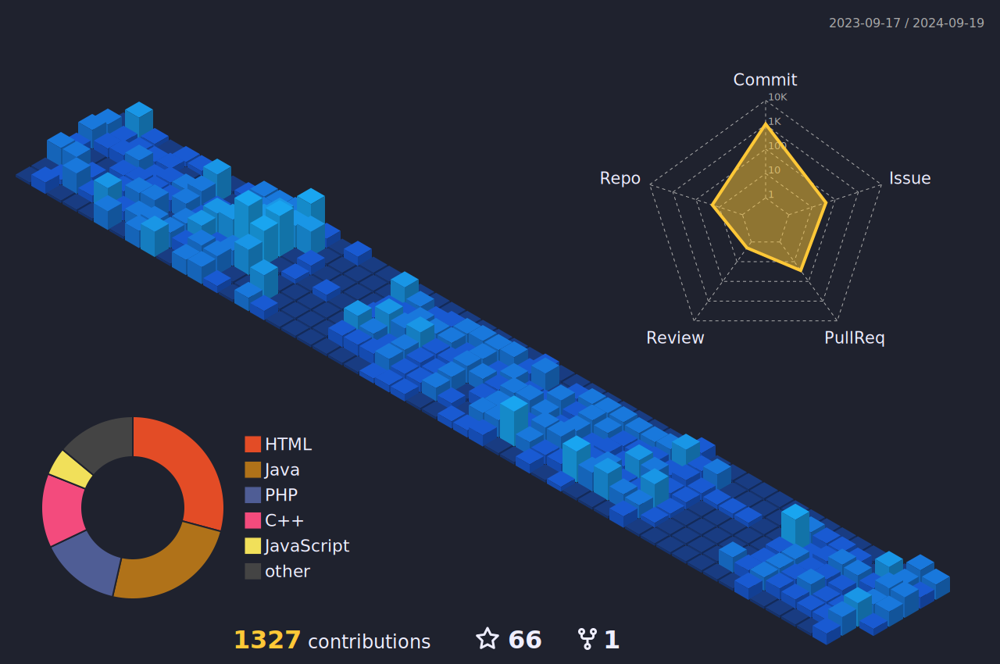

<h3>

I’m currently a `Systems Development` student with a strong passion for `Data Science` in my spare time.

- 👨🏻‍💻 Systems Development `Student` at SENAI
- 📘 Main Areas of Study:
    - `Data Analysis` and `Data Science`
    - `Artificial Intelligence (AI)` and `Neural Networks`
    - `Machine Learning` and `Deep Learning`
    - `Automation` and `Process Optimization`
- 🎲 Check out my data science projects and ongoing studies ➡️ **[CapellaInfo](https://github.com/CapellaInfo)**
- 🖥️ Current Focus:

  &nbsp;&nbsp;&nbsp;&nbsp;
  &nbsp;&nbsp;&nbsp;&nbsp;&nbsp;
  &nbsp;&nbsp;&nbsp;&nbsp;&nbsp;
  &nbsp;&nbsp;&nbsp;&nbsp;&nbsp;
  &nbsp;&nbsp;&nbsp;&nbsp;&nbsp;

 
</h3>

    
### Connect with me:

  &nbsp;
  &nbsp;
  

 

   
  

 

   

 

  <a href="https://github.com/rafaelmoura23">
    <picture>
      <source media="(prefers-color-scheme: light)" srcset="src/images/profile-3d/profile-custom-season.svg">
      
    </picture>
  </a>
    

